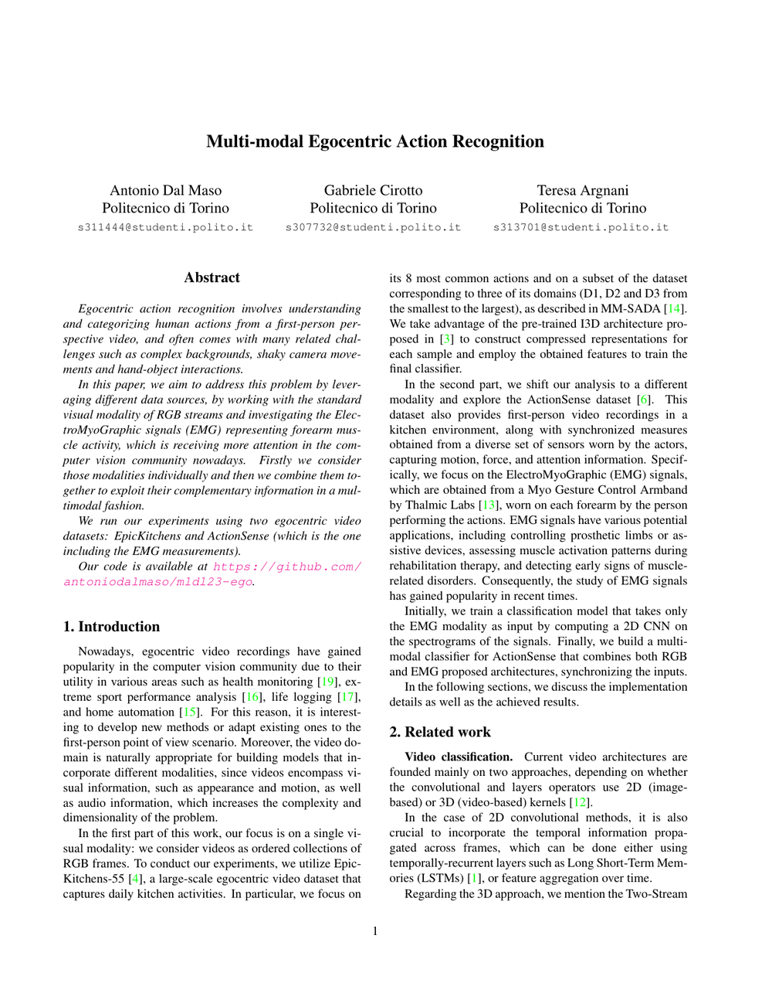

# Multi-modal Egocentric Action Recognition

This project studies **egocentric (first-person) action recognition** using complementary sensing modalities. The goal is to understand how standard RGB video and **electromyography (EMG)** signals can be used individually and together to recognize human actions from a first-person perspective.

The experiments cover two egocentric video datasets, **EPIC-KITCHENS-55** and **ActionSense**. For the visual modality, the project uses **I3D** features extracted from RGB video. For EMG, the work explores both recurrent models and convolutional models operating on signal spectrograms. The final multimodal architecture combines RGB and EMG representations to exploit their complementary information.

This project was developed as part of the "Machine Learning and Deep Learning" course at Politecnico di Torino (2023).

## Report

**[Read the full report (PDF)](./MLDL_REPORT.pdf)**

## Authors

- Antonio Dal Maso
- Gabriele Cirotto
- Teresa Argnani

Politecnico di Torino
